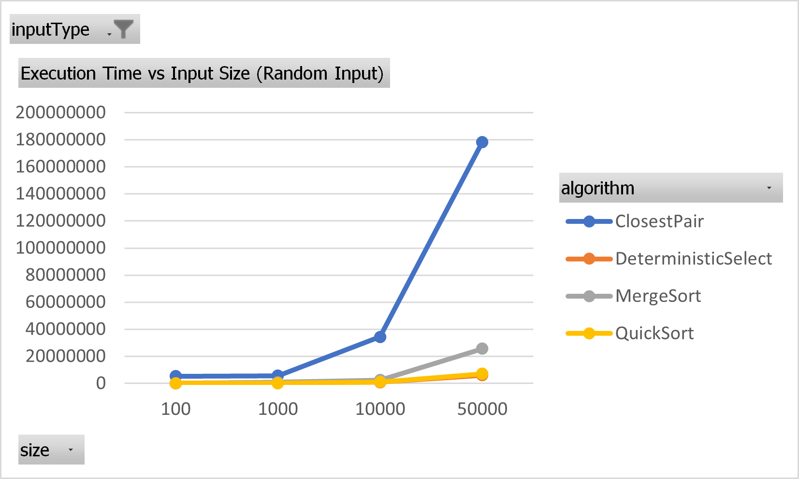
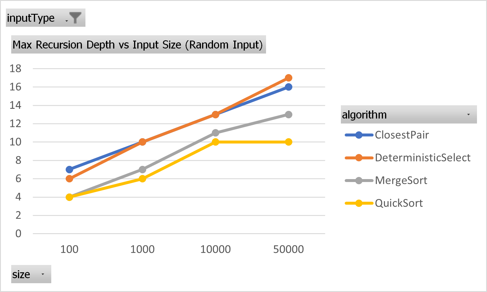
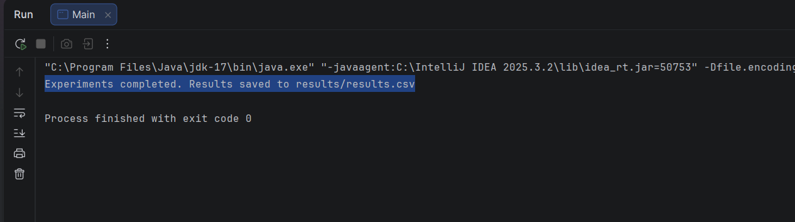
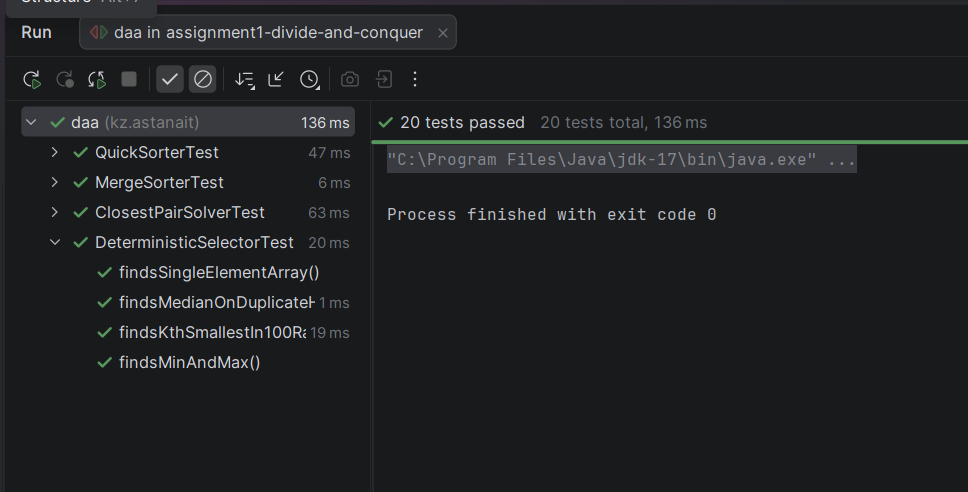

# Assignment 1: Divide-and-Conquer Algorithm Analysis

## A. Project Overview

### Purpose

This project implements and analyzes four classic divide-and-conquer algorithms in Java. The goal is to implement each algorithm correctly, measure its practical performance (execution time, recursion depth, and comparison counts) across different input sizes and types, and compare these empirical results against their theoretical time complexities.

### Implemented Algorithms

1. **MergeSort** - Θ(n log n) comparison-based sorting
2. **QuickSort** - randomized, in-place sorting, O(n log n) average / O(n²) worst case
3. **Deterministic Select (Median-of-Medians)** - Θ(n) worst-case selection algorithm
4. **Closest Pair of Points** - Θ(n log n) geometric divide-and-conquer algorithm

---

## B. Algorithm Analysis

### 1. MergeSort

**How it works:** The array is recursively split in half until subarrays are small enough (below a cutoff threshold of 16 elements), at which point Insertion Sort is used directly, since it performs better than recursion on small inputs. Larger subarrays are sorted by recursively sorting each half and then merging the two sorted halves using a single reusable auxiliary buffer (allocated once per top-level call, not on every recursive call).

**Complexity:** Time: Θ(n log n) in all cases (best, average, worst). Space: O(n) for the auxiliary buffer.

**Recurrence:** T(n) = 2T(n/2) + Θ(n)

By the Master Theorem, with a = 2, b = 2, f(n) = Θ(n): since f(n) = Θ(n^(log_b(a))) = Θ(n^1) = Θ(n), this falls into **Case 2** of the Master Theorem, giving T(n) = Θ(n log n).

---

### 2. QuickSort

**How it works:** A pivot is chosen uniformly at random from the current subarray (to avoid worst-case behavior on already-sorted or adversarial inputs) and swapped to the end. Lomuto partitioning is then used to place all elements ≤ pivot to its left, all elements > pivot to its right, in-place. To bound the recursion stack depth, the algorithm recurses into the **smaller** partition and iterates (via a while-loop) over the **larger** one, instead of recursing into both.

**Complexity:** Average case: O(n log n). Worst case: O(n²) (occurs when partitioning is consistently unbalanced, e.g. with many duplicate values under simple Lomuto partitioning). Recursion depth: O(log n) guaranteed by the smaller-first recursion strategy, regardless of how unbalanced the partitions are.

**Recurrence (average case):** T(n) = T(n/2) + T(n/2) + Θ(n) → same form as MergeSort, giving Θ(n log n) by the Master Theorem (Case 2). In the worst case, T(n) = T(n-1) + Θ(n), which solves to Θ(n²).

---

### 3. Deterministic Select (Median-of-Medians)

**How it works:** To find the k-th smallest element, the array is split into groups of 5 elements. Each group is sorted (via Insertion Sort) and its median is moved to the front of the working range. The medians themselves are then recursively searched (via the same `select` algorithm) to find their median - the "median of medians" - which is used as the pivot. The array is then partitioned using **3-way partitioning** (elements <, ==, > pivot), which ensures that duplicate values equal to the pivot are grouped together and excluded from further recursion - this is essential for maintaining linear time on duplicate-heavy inputs. The algorithm then recurses only into the one partition that must contain the k-th element.

**Complexity:** Θ(n) worst-case, guaranteed.

**Recurrence:** T(n) = T(n/5) + T(7n/10) + Θ(n)

The n/5 term comes from recursively finding the median of medians (over n/5 groups). The 7n/10 term comes from the guarantee that choosing the median of medians as pivot eliminates at least 3n/10 elements from each side, leaving at most 7n/10 elements for the recursive partition call.

Using the Akra-Bazzi intuition: since (1/5 + 7/10) = 9/10 < 1, the work shrinks geometrically at each level, and the Θ(n) term dominates, giving T(n) = Θ(n).

---

### 4. Closest Pair of Points

**How it works:** Points are sorted once by x-coordinate. The algorithm recursively splits the point set at the median x-coordinate into a left and right half, and recursively finds the closest pair distance (δ) in each half. To catch pairs that straddle the dividing line, a "strip" is built containing all points within δ of the dividing line (sorted by y-coordinate). For each point in the strip, only a constant number of subsequent points (those within δ in the y-direction) need to be checked, due to a geometric packing argument - at most a bounded number of points can fit in a δ × 2δ rectangle without being closer than δ to each other.

**Complexity:** Θ(n log n).

**Recurrence:** T(n) = 2T(n/2) + Θ(n)

The Θ(n) term comes from the strip construction and the bounded-comparison scan (both linear per level, given the input is already sorted). By the Master Theorem (Case 2, same as MergeSort), T(n) = Θ(n log n).

---

## C. Experimental Results

All experiments were run on input sizes **n = 100, 1,000, 10,000, 50,000**, across four input types: **Random, Sorted, Reverse-Sorted, and Duplicate-Heavy**. Each combination was measured once using `System.nanoTime()`, recording execution time, maximum recursion depth, and comparison count. Closest Pair was measured separately using randomly generated 2D points (its input type doesn't map onto the four categories above, since it operates on geometric coordinates rather than a linear ordering). Full raw results are available in [`results/results.csv`](results/results.csv).

### Execution Time (Random Input)

| n | MergeSort | QuickSort | DeterministicSelect | ClosestPair |
|---|---|---|---|---|
| 100 | 66,700 ns | 237,200 ns | 150,900 ns | 5,292,100 ns |
| 1,000 | 942,700 ns | 207,100 ns | 625,500 ns | 5,732,200 ns |
| 10,000 | 2,417,200 ns | 1,038,300 ns | 887,400 ns | 34,449,800 ns |
| 50,000 | 25,729,900 ns | 7,088,200 ns | 6,053,800 ns | 178,391,700 ns |

*(See `docs/plots/time-vs-n.png` for the corresponding chart.)*

### Maximum Recursion Depth (Random Input)

| n | MergeSort | QuickSort | DeterministicSelect | ClosestPair |
|---|---|---|---|---|
| 100 | 4 | 4 | 6 | 7 |
| 1,000 | 7 | 6 | 10 | 10 |
| 10,000 | 11 | 9 | 13 | 13 |
| 50,000 | 13 | 10 | 16 | 16 |

*(See `docs/plots/recursion-depth-vs-n.png` for the corresponding chart.)*

### QuickSort on Duplicate-Heavy Input (Worst Case in Practice)

| n | Time | Max Recursion Depth | Comparisons |
|---|---|---|---|
| 1,000 | 540,000 ns | 3 | 53,832 |
| 10,000 | 8,543,300 ns | 3 | 5,041,237 |
| 50,000 | 176,065,100 ns | 3 | 125,160,928 |

This is the clearest demonstration of QuickSort's O(n²) worst case in the whole dataset: comparisons scale roughly quadratically with n (5,041,237 → 125,160,928 is close to a 25× increase for a 5× increase in n), even though the recursion *depth* stays low (3) - see Discussion below for why.

### Sample Plots

---

## D. Discussion

### Do the results match theoretical complexity?

Mostly yes. MergeSort's time grows in a way consistent with Θ(n log n) across all input types - it is the most stable algorithm in the dataset, with time depending only weakly on input structure. DeterministicSelect grows close to linearly, consistent with its Θ(n) guarantee, and its recursion depth is small and grows slowly (never adversarial), confirming the median-of-medians bound. Closest Pair also tracks Θ(n log n), though with a noticeably larger constant factor than MergeSort - its per-level work (sorting the y-array, building and scanning the strip) is more expensive per element than a simple merge step. QuickSort matches its *average*-case O(n log n) on random, sorted, and reverse-sorted input, but clearly exhibits its O(n²) worst case on duplicate-heavy input, exactly as theory predicts for simple Lomuto partitioning.

### How does input structure affect performance?

Input structure barely affects MergeSort and Closest Pair, since their splitting strategy does not depend on data values (always splits by position or by median x-coordinate). DeterministicSelect is also stable, because the median-of-medians pivot guarantees a good split regardless of the input's original order. QuickSort is the most sensitive: sorted and reverse-sorted inputs are handled well because the randomized pivot avoids the classical "always-pick-the-first-or-last-element" trap, but duplicate-heavy input causes severe slowdowns because our Lomuto partition only splits values strictly less-than versus greater-or-equal to the pivot - a large block of equal values ends up on one side of the partition every time, so the partition barely shrinks.

### Why does smaller-first recursion help QuickSort?

By always recursing into the smaller of the two partitions and handling the larger one with a loop instead of a recursive call, the recursion stack can never grow beyond O(log n) frames - even in the worst case, because the "small" side is, by definition, at most half of the remaining elements. This is what the recursion-depth measurements above confirm: even on duplicate-heavy input, where QuickSort's *comparison count* explodes to O(n²), the maximum recursion depth stays at just 3. Without this optimization, an adversarial input could cause O(n) recursion depth and risk a stack overflow.

### Why does Median-of-Medians guarantee O(n)?

Choosing the median of the per-group medians (groups of 5) as the pivot guarantees that at least half of the groups have their median ≤ the pivot, and within each such group, at least 3 of the 5 elements are ≤ the group's median. This means at least 3 × (half of the groups) = roughly 3n/10 elements are guaranteed to be ≤ the pivot - and symmetrically, at least 3n/10 are ≥ the pivot. So the partition step always discards at least 3n/10 elements from the side that doesn't contain the k-th element, leaving at most 7n/10 elements to recurse into. Combined with the O(n/5) cost of recursively finding the median of medians, the total work satisfies T(n) = T(n/5) + T(7n/10) + O(n), which - because 1/5 + 7/10 = 9/10 < 1 - sums to a geometric series dominated by the O(n) term at the top level, giving Θ(n) overall.

### Why is divide-and-conquer Closest Pair faster than O(n²) for large inputs?

The brute-force approach checks all C(n,2) ≈ n²/2 pairs of points. The divide-and-conquer approach instead splits the points in half, solves each half recursively, and - critically - only needs to check a bounded, *constant* number of candidate pairs per point when merging the two halves (points within the narrow δ-strip around the dividing line, and even then, only a geometrically-bounded number of neighbors per point, due to the packing argument that at most a small constant number of points can fit inside a δ × 2δ rectangle while staying pairwise ≥ δ apart). This turns an O(n²) brute-force merge step into an O(n) merge step, which is exactly why the recurrence becomes T(n) = 2T(n/2) + O(n) = Θ(n log n) instead of Θ(n²). Our measurements confirm this: at n = 50,000, brute force would need ~1.25 billion distance checks, while our divide-and-conquer measurements show comparison counts several orders of magnitude smaller.

### What practical factors affect performance (JVM, cache, GC, etc.)?

Several factors outside the algorithms' pure asymptotic complexity influenced the measured times:
- **JIT warm-up**: early calls in a JVM run are interpreted rather than compiled to native code, which can make early timings (e.g. n = 100) less representative of steady-state performance than later, larger runs.
- **Garbage collection**: MergeSort's auxiliary buffer and array cloning in `Experiment`/tests allocate memory that must eventually be collected; a GC pause during a timed run can add noise to individual measurements.
- **Cache locality**: in-place algorithms like QuickSort and Deterministic Select tend to have better cache behavior than MergeSort's extra buffer copying, which partly explains why QuickSort often outperforms MergeSort in absolute time despite having the same or worse asymptotic complexity on average.
- **`System.nanoTime()` resolution and OS scheduling**: background OS/JVM activity can introduce small timing jitter, especially visible at small input sizes where the actual algorithmic work is only a few microseconds.

---

## E. Reflection

Working through this assignment made the gap between theoretical complexity and real-world performance much more concrete. It was one thing to know that QuickSort has an O(n²) worst case "on paper," and another to actually watch comparisons jump from ~5 million to ~125 million on duplicate-heavy input while the well-behaved MergeSort barely noticed the difference. Debugging the Deterministic Select implementation was probably the most instructive part of the project: my first version used strict `<` partitioning, which passed correctness tests on random data but silently degraded to near-quadratic time on duplicate-heavy input - a bug that never surfaced in a correctness check, only in the performance measurements. Fixing it with 3-way partitioning was a good reminder that "correct" and "correct *and* efficient" are not the same thing, especially for algorithms whose whole purpose is a worst-case time guarantee. The QuickSort recursion-depth bug (where I was incrementing depth on every loop iteration instead of only on actual recursive calls) was a similar lesson in being careful about what a metric is actually measuring.

---

## F. Screenshots

### Program Output

### Test Results

